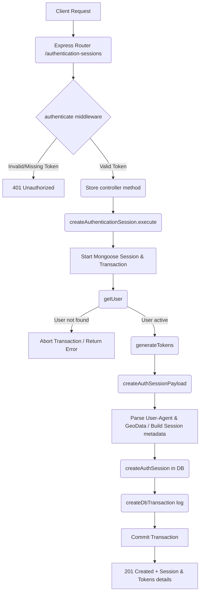

# Create Authentication Session Workflow

**Title:** Create Session on Authentication

## **Workflow Diagram**

## **Acceptance Criteria**

- **Required Headers:**
  - `Authorization` (String: `"Bearer <accessToken>"`)
- **System-read Fields (Headers):**
  - `User-Agent` (For device type, OS, and browser parsing)
  - IP Address and location geo-data (extracted from client connection)

## **Validation & Error Handling**

- If user is not found in database -> `user_not_found`
- If session document creation fails -> `auth_session_not_created`

## **Transaction & Consistency**

- All steps run inside a Mongoose session.
- Database changes are rolled back on any verification failure.
- Successful sessions commit new AuthSession record and record creation transaction in audit trail.

## **Response**

### **Success Response:**
- Code: `201 Created`
- Message: `"session_created"`
- Data: Created session object containing `userId`, tokens, `device`, `ipAddress`, `location`, `expiresAt`

### **Error Response:**
- Code: `400 Bad Request` / `404 Not Found` / `500 Internal Server Error`

## **Core Functions / Class Responsibilities**

| Function / Class | Responsibility |
| --- | --- |
| createAuthenticationSession | Main service execution managing transaction lifecycle. |
| getUser | Resolves the user associated with the active token inside session. |
| parseUserAgent | Extract OS, browser and device type from User-Agent string. |
| createAuthSessionPayload | Prepares IAuthSession schema format using request metadata. |
| createAuthSession | Saves session record in database and posts transaction logs. |
