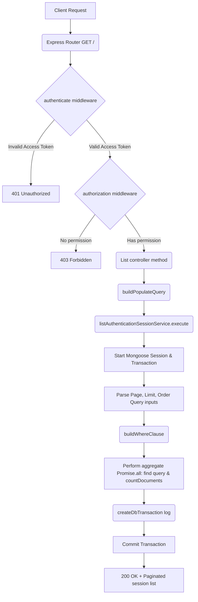

# List Sessions Workflow

**Title:** List & Filter User Sessions

## **Workflow Diagram**

## **Acceptance Criteria**

- **Optional Query Parameters:**
  - `page` (Number, defaults to 1)
  - `limit` (Number, defaults to 10)
  - `order_by` (String)
  - `order_direction` (String: `"asc"` or `"desc"`)
  - `fields` (Comma separated string of select fields)
  - `populate` (String)

## **Validation & Error Handling**

- Checks query params format.
- Catch all query executions with database rollback on failure.

## **Transaction & Consistency**

- Read query is executed inside a transaction session.
- Commits transaction on completion and generates read transaction log.

## **Response**

### **Success Response:**
- Code: `200 OK`
- Message: `"authentication_sessions_listed"`
- Data: Paginated list of sessions (`current_page`, `totalCount`, `rows_per_page`, `last_page`, `rows`)

### **Error Response:**
- Code: `400 Bad Request` / `500 Internal Server Error`

## **Core Functions / Class Responsibilities**

| Function / Class | Responsibility |
| --- | --- |
| listAuthenticationSessionService | Orchestrates pagination math, filters building, DB fetches. |
| buildWhereClause | Construct Mongo filter conditions based on query params. |
| buildQuery | Chains populate, select fields, sort ordering, limit and skip pagination rules. |
