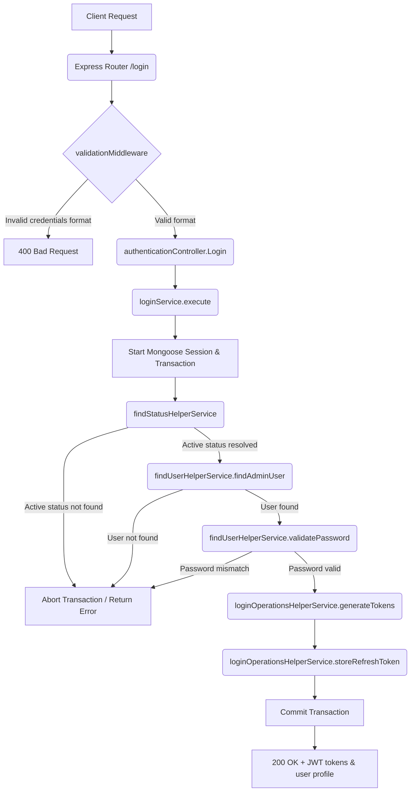

# User Login Workflow

**Title:** Standard User/Admin Login with Credentials

## **Workflow Diagram**

## **Acceptance Criteria**

- **Required Fields:**
  - `email` (String, valid email format)
  - `password` (String, minimum 6 characters)

## **Validation & Error Handling**

- If email format is invalid -> `validation_error`
- If password length is less than 6 characters -> `validation_error`
- If status collection does not have 'active' state -> status error
- If user with given email does not exist under active status -> `user_not_found`
- If credentials do not match -> `invalid_credentials`

## **Transaction & Consistency**

- All steps run inside a Mongoose session.
- Database changes are rolled back on any validation/password check failure.
- Stores the newly generated refresh token in database on success.

## **Response**

### **Success Response:**
- Code: `200 OK`
- Message: `"admin_login"`
- Data: User object, accessToken, refreshToken, tokenType (`"Bearer"`)

### **Error Response:**
- Code: `400 Bad Request` / `401 Unauthorized` / `404 Not Found`
- Standardized error format.

## **Core Functions / Class Responsibilities**

| Function / Class | Responsibility |
| --- | --- |
| loginService | Coordinates the transaction lifecycle and login logic execution. |
| findStatusHelperService | Queries the status collection for the "active" status id. |
| findUserHelperService | Finds user record by email and status and validates hashed password comparison. |
| loginOperationsHelperService | Generates JWT Access/Refresh tokens and writes the session/refresh token doc. |
