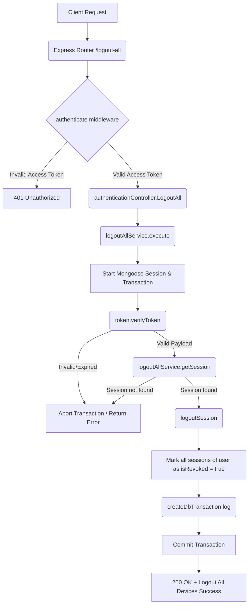

# Logout All Devices Workflow

**Title:** Revoke All Active Sessions (Logout from All Devices)

## **Workflow Diagram**

## **Acceptance Criteria**

- **Required Headers:**
  - `Authorization` (String: `"Bearer <accessToken>"`)
- **Required Fields:**
  - `refresh_token` (String, in body)

## **Validation & Error Handling**

- If access token is invalid or expired -> `invalid_access_token`
- If no session associated with the user is found -> `session_not_found`
- Database update errors roll back all changes.

## **Transaction & Consistency**

- Runs inside a Mongoose session.
- Commits changes to mark all sessions for the target user as revoked. Rolls back on failure.

## **Response**

### **Success Response:**
- Code: `200 OK`
- Message: `"logout_successful_from_all_devices"`
- Data: Empty string

### **Error Response:**
- Code: `400 Bad Request` / `401 Unauthorized` / `404 Not Found`

## **Core Functions / Class Responsibilities**

| Function / Class | Responsibility |
| --- | --- |
| logoutAllService | Coordinates token validation, user session checks, and multi-session revocation. |
| verifyToken | Checks access token validity and extracts user information. |
| getSession | Assures the user has at least one active session recorded. |
| logoutSession | Updates all database sessions belonging to the user setting `isRevoked` to true. |
