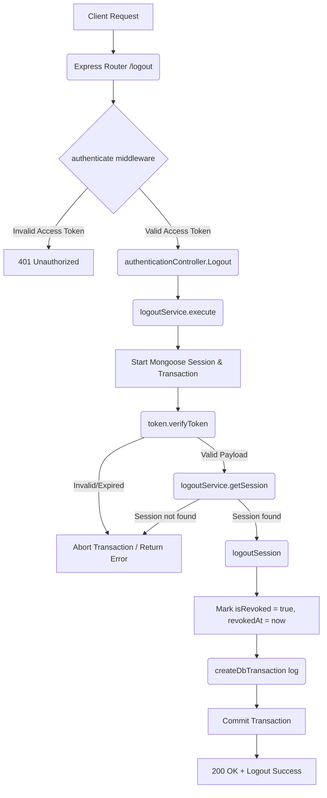

# Logout Workflow

**Title:** Revoke User Session (Logout)

## **Workflow Diagram**

## **Acceptance Criteria**

- **Required Headers:**
  - `Authorization` (String: `"Bearer <accessToken>"`)
- **Required Fields:**
  - `refresh_token` (String, in body)

## **Validation & Error Handling**

- If access token is invalid or expired -> `invalid_access_token`
- If session matching access token `jti` is not found -> `session_not_found`
- Any database error -> rollback session and return standardized error

## **Transaction & Consistency**

- Runs inside a Mongoose session.
- Commits changes to target refresh session. Rolls back on failures.

## **Response**

### **Success Response:**
- Code: `200 OK`
- Message: `"logout_successful"`
- Data: Verified token payload

### **Error Response:**
- Code: `400 Bad Request` / `401 Unauthorized` / `404 Not Found`

## **Core Functions / Class Responsibilities**

| Function / Class | Responsibility |
| --- | --- |
| logoutService | Manages request parsing, token verification, session lookup and revocation. |
| verifyToken | Checks access token validity and retrieves token payload (jti/user id). |
| getSession | Queries Mongoose for the session matching the `jti` of the access token. |
| logoutSession | Sets the session as revoked, saves it, and appends to transaction log. |
