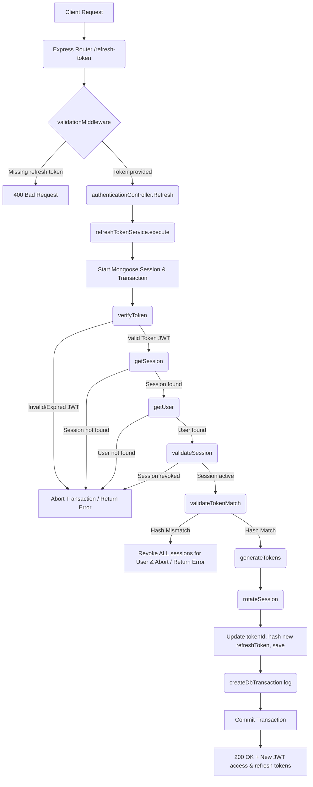

# Refresh Token Workflow

**Title:** Refresh Token Rotation Lifecycle

## **Workflow Diagram**

## **Acceptance Criteria**

- **Required Fields:**
  - `refresh_token` (String, in body)

## **Validation & Error Handling**

- If token verification fails -> `invalid_refresh_token`
- If session matching token `jti` is not found -> `session_not_found`
- If user associated with the token is not found -> `user_not_found`
- If session is already marked revoked -> `session_revoked`
- If token hash mismatch occurs -> `invalid_refresh_token` (and all user sessions are immediately revoked as a security precaution)

## **Transaction & Consistency**

- All steps run within a Mongoose session.
- Commits token rotation details on success. Rolls back on error.
- Implements immediate security revocation of all sessions on token misuse detection.

## **Response**

### **Success Response:**
- Code: `200 OK`
- Message: `"token_refreshed"`
- Data: User object, accessToken, refreshToken, tokenType (`"Bearer"`)

### **Error Response:**
- Code: `400 Bad Request` / `401 Unauthorized` / `404 Not Found`

## **Core Functions / Class Responsibilities**

| Function / Class | Responsibility |
| --- | --- |
| refreshTokenService | Coordinates token validation, session check, hash matching, and rotation lifecycle. |
| verifyToken | Checks token format, signature, and retrieves the token payload. |
| getSession | Retrieves session document from database using `jti`. |
| validateSession | Checks that the session has not been revoked. |
| validateTokenMatch | Validates current token against stored hash; triggers complete user revocation on failure. |
| rotateSession | Updates session document with new token identifier, expiration, and hashed value. |
