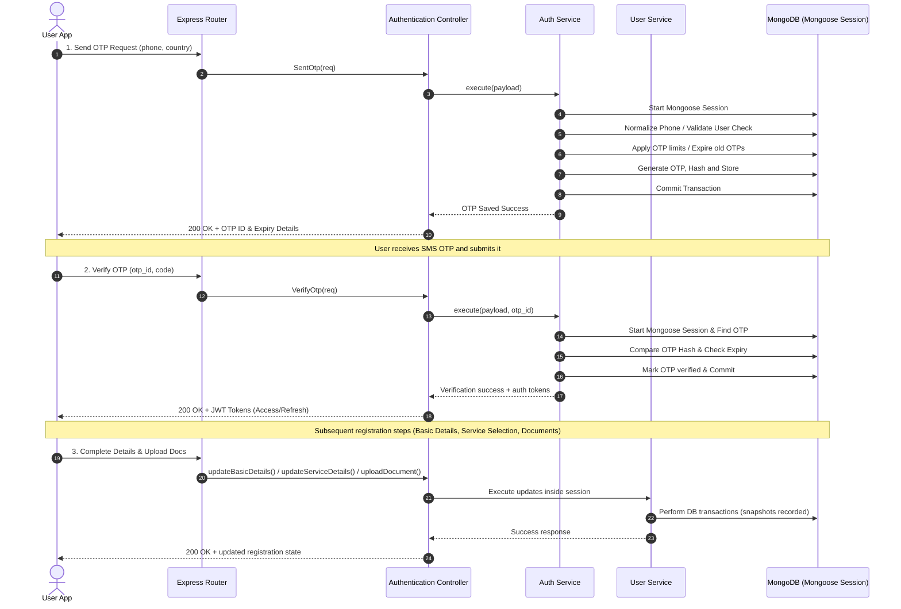

# User Story: Phone-Based Account Creation

<b>Title: User Signup with Phone Number Verification.</b> As a new user,
I want to create an account using my phone number and verify it with a code,
So that I can securely access the platform and use its services.

## **Workflow Diagram**

## **Screen Play**

- <b>Screen one: Phone Entry Screen</b>

  > - User enters phone number
  > - Selects/auto-detects country code (default like +64)
  > - Accepts Terms & Conditions checkbox
  > - Clicks Send OTP

- <b>Screen Two: OTP Verification Screen</b>

  > - Auto OTP fetch (if permitted)
  > - Countdown timer (2 minutes)
  > - Resend OTP option after timeout
  > - Auto submit OTP

- <b>Screen Three: Basic Details Screen</b>

  > - First Name
  > - Surname
  > - Address (autocomplete)
  > - Business Name (optional)
  > - Postcode (auto-filled)
  > - Country (auto-filled)

- <b>Screen Four: Service Selection Screen</b>

  > - User selects trade categories (e.g., plumber, electrician)
  > - Show count of selected items
  > - Show count of each category

- <b>Screen Five: Document Upload Screen</b>

  > - Required documents shown based on services
  > - Upload via:
  >   - Camera
  >   - Gallery

- <b>Screen Six: Registration Completion</b>

  > - Account created
  > - Redirect to dashboard / pending verification state

## **Acceptance Criteria**

- User cannot proceed without valid phone number
- OTP must be successfully delivered before moving forward
- OTP expires after defined time (e.g., 2 minutes)
- Resend OTP works with rate limiting
- Address autocomplete returns valid structured data
- Required documents must be uploaded before completion
- Registration completes only when all mandatory steps are done
- System supports multiple countries but restricts unsupported ones

## **Responsibilities Breakdown**

- <b>Frontend (Android/Web)</b>

  > - Phone input validation (basic format, numeric, length)
  > - Country picker + default country code
  > - Terms checkbox handling
  > - OTP screen:
  >   - Auto-read OTP (SMS Retriever API / iOS equivalent)
  >   - Countdown timer
  >   - Resend button state
  > - Address autocomplete integration (e.g., Google Places)
  > - Form validation (required fields, UI errors)
  > - File upload handling (camera + gallery)
  > - Progress state management (step-by-step flow)

- <b>Backend</b>

  > - Validate phone number (strict E.164 format)
  > - Check country eligibility
  > - OTP generation, storage, expiration
  > - OTP delivery (SMS provider integration)
  > - OTP verification
  > - Rate limiting (resend attempts)
  > - User creation & session/token generation
  > - Address enrichment:
  >   - lat, lng, suburb, state, country
  > - Service-to-document mapping logic
  > - Document storage (S3 / cloud storage)
  > - Registration status tracking

## **Enhancements**

- Social login (Google/Apple)
- Multi-language support
- Save & resume registration
- AI-based document verification
- Address validation fallback if API fails
- Profile completion percentage

## **Security**

- OTP expiry (2 minutes)
- OTP attempt limits (e.g., max 5 tries)
- Rate limiting (resend OTP)
- JWT token after OTP verification
- Encrypt sensitive data
- Secure file upload (signed URLs)
- Prevent replay attacks

## **Edge Cases**

- OTP not received
- Network failure during OTP validation
- User enters wrong OTP multiple times
- Country not supported
- Address API failure
- Partial registration abandonment
- Duplicate phone number
- File upload failure
- Camera permission denied

## **Optional Improvements**

- Auto-detect country via SIM/IP
- Smart OTP auto-submit
- Offline draft saving
- Push notification fallback for OTP
- WhatsApp OTP fallback
- Document upload progress bar

## **Validation & Error Handling**

- Phone
  - Invalid format
  - Unsupported country
  - Already registered
- OTP
  - Incorrect OTP
  - Expired OTP
  - Too many attempts
- Basic Details
  - Missing required fields
  - Invalid postcode
  - Address not selectable
- Documents
  - Unsupported format
  - File size exceeded
  - Missing required documents

## **Transaction & Audit Trail**

- All operations run inside a Mongoose session to guarantee consistency.
- On failure at any step, the entire transaction is rolled back (no partial updates).
- All actions are recorded in the DbTransaction audit log.
  - OTP generated
  - OTP sent (success/failure)
  - OTP verified
  - Profile created
  - Address updated
  - Services selected
  - Documents uploaded
- On success, the response includes:
  - the updated country object, and
  - the list of executed transactions.

## **Technical Notes**

- Status values (Active, Parent Deleted) are dynamically fetched from the status collection (not hardcoded).
- Entity changes are tracked using snapshot comparison helpers.

## **Core Functions / Class Responsibilities**

| Function / Class         | Service         | Responsibility |
| ------------------------ | --------------- | -------------- |
| sendOTP                  | Auth Service    | Main entry     |
| verifyOTP                | Auth Service    | Main entry     |
| resendOTP                | Auth Service    | Main entry     |
| createUser               | User Service    | Main entry     |
| updateBasicDetails       | User Service    | Main entry     |
| updateServiceDetails     | User Service    | Main entry     |
| UpdateDocumentDetails    | User Service    | Main entry     |
| updateRegistrationStatus | User Service    | Main entry     |
| updatePermissionDetails  | User Service    | Main entry     |
| autocomplete             | Address Service | Main entry     |
| getAddressDetails        | Address Service | Main entry     |
| getServiceList           | Service Service | Main entry     |
| getRequiredDocuments     | Service Service | Main entry     |
| uploadDocument           | Service Service | Main entry     |
| validateDocument         | Service Service | Main entry     |
| getUserDocuments         | Service Service | Main entry     |
