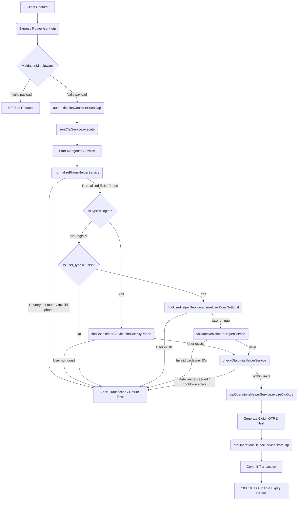

# Sent OTP Workflow

**Title:** Sent OTP to Phone Number

## **Workflow Diagram**

## **Acceptance Criteria**

- **Required Fields:**
  - `phone` (String, valid formats based on country code, normalized to E.164)
  - `country` (String, 2-letter ISO country code)
  - `type` (String: `"login"` or `"register"`)
  - `device_id` (String)
  - `user_type` (String: `"user"`, `"admin"`, or `"employee"`)
- **Conditional Fields:**
  - `declaimers` (Array of objects containing `declaimer_id` and `accepted: true`, minimum 1 item, required only when `type` is `"register"`)

## **Validation & Error Handling**

- If `country` code is not supported or not found -> `country_not_found`
- If phone number is invalid -> `invalid_phone_number`
- If phone number doesn't match the country -> `phone_country_mismatch`
- If `type` is `"login"` and user does not exist -> `user_not_found`
- If `type` is `"register"` and role is not `"user"` -> `registration_role_restricted`
- If `type` is `"register"` and user already exists -> `user_already_exists`
- If invalid declaimer IDs are provided -> `invalid_declaimer_ids`
- If OTP request limit exceeded -> `otp_rate_limit_exceeded`
- If OTP cooldown is active -> `otp_cooldown_active`

## **Transaction & Consistency**

- All actions run within a Mongoose session.
- Database changes are rolled back on any verification failure.
- Successful executions store the OTP document with hashed OTP value, `expires_at` (5 minutes expiry time), and transaction log `DbTransactions`.

## **Response**

### **Success Response:**
- Code: `200 OK`
- Message: `"otp_sent_successfully"`
- Data: OTP record ID and expiry timestamp

### **Error Response:**
- Code: `400 Bad Request` / `409 Conflict` / `404 Not Found`
- Standardized error format with code and descriptive validation messages.

## **Core Functions / Class Responsibilities**

| Function / Class | Responsibility |
| --- | --- |
| normalizePhoneHelperService | Normalizes input phone to standard E164 formatting. |
| findUserHelperService | Validates user existence (exists for login, doesn't exist for register). |
| validateDeclaimersHelperService | Validates that declaimers are correct and active in the database. |
| checkOtpLimitsHelperService | Verifies that rate limiting and cooldown rules are satisfied. |
| otpOperationsHelperService | Expire old OTPs, store and save the new OTP record. |
