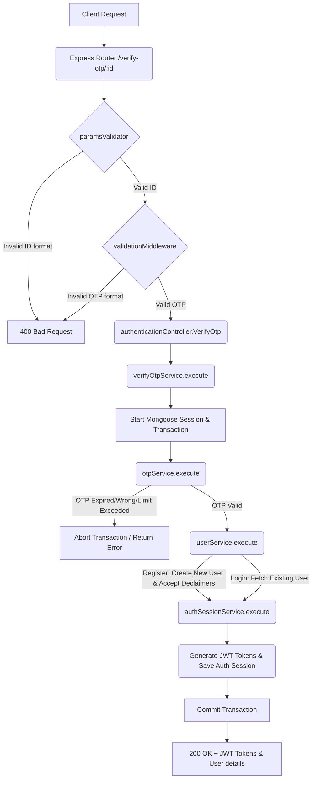

# Verify OTP Workflow

**Title:** Verify OTP & Authenticate User

## **Workflow Diagram**

## **Acceptance Criteria**

- **Required Parameters:**
  - `id` in path (MongoDB ObjectId representing the OTP session)
- **Required Fields:**
  - `otp` (String, 6-digit numeric OTP)

## **Validation & Error Handling**

- If parameter `id` is not a valid ObjectId -> `invalid_id`
- If OTP document is not found -> `otp_not_found`
- If OTP has already been verified or deactivated -> `otp_already_verified`
- If OTP is expired -> `otp_expired`
- If incorrect OTP is entered -> `incorrect_otp` (tracks attempts and locks if limit exceeded)
- If too many incorrect attempts -> `otp_max_attempts_exceeded`

## **Transaction & Consistency**

- All steps run inside a Mongoose session.
- Database changes are rolled back on any verification failure.
- Successful verification commits changes including user state, otp update, and session creation.

## **Response**

### **Success Response:**
- Code: `200 OK`
- Message: `"otp_verified_successfully"`
- Data: User object, accessToken, refreshToken, tokenType (`"Bearer"`)

### **Error Response:**
- Code: `400 Bad Request` / `401 Unauthorized` / `404 Not Found`
- Standardized error format with error code.

## **Core Functions / Class Responsibilities**

| Function / Class | Responsibility |
| --- | --- |
| verifyOtpService | Main orchestrator managing the database session and flow. |
| otpService | Validates the OTP against the database and compares hash. |
| userService | Creates user (register) or checks details (login). |
| authSessionService | Generates Access/Refresh JWT tokens and saves the session. |
