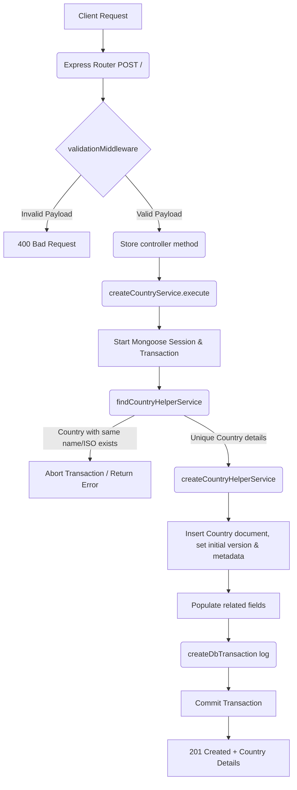

# Create Country Workflow

**Title:** Create a New Country Record

## **Workflow Diagram**

## **Acceptance Criteria**

- **Required Fields:**
  - `name` (String, unique name of country)
  - `iso_code` (String, 2-letter uppercase ISO code, unique)
  - `iso_code_3` (String, 3-letter uppercase ISO code, unique)
  - `phone_code` (String)

## **Validation & Error Handling**

- If country with duplicate name, `iso_code` or `iso_code_3` exists -> `country_already_exists`
- Standard request parsing and formatting errors mapping.

## **Transaction & Consistency**

- Database calls run inside a Mongoose session.
- Failure of duplicates check rolls back all operations.
- Successful creations write the country record and log to DbTransaction audit.

## **Response**

### **Success Response:**
- Code: `201 Created`
- Message: `"country_created"`
- Data: Structured country document array containing `name`, `iso_code`, `iso_code_3`, `phone_code`, etc.

### **Error Response:**
- Code: `400 Bad Request` / `409 Conflict`
