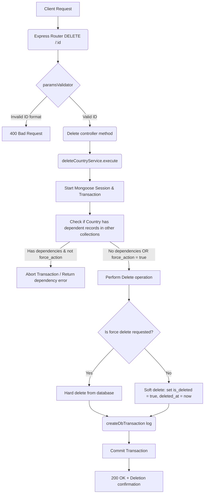

# Delete Country Workflow

**Title:** Soft/Force Delete Country

## **Workflow Diagram**

## **Acceptance Criteria**

- **Required parameters:**
  - `id` in path (valid MongoDB ObjectId)
- **Optional Query parameters:**
  - `force_action` (Boolean: if true, allows force/hard deletion)

## **Validation & Error Handling**

- If country ID is invalid -> `invalid_id`
- If country does not exist -> `country_not_found`
- If has relational dependencies (e.g. states, regions, districts, providers) and `force_action` is false -> returns validation error mapping dependencies

## **Transaction & Consistency**

- Deletion steps execute inside a transactional session.
- Database changes are rolled back on dependency constraints violation.

## **Response**

### **Success Response:**
- Code: `200 OK`
- Message: `"country_deleted"`
- Data: Deleted country document details

### **Error Response:**
- Code: `400 Bad Request` / `409 Conflict` / `404 Not Found`
