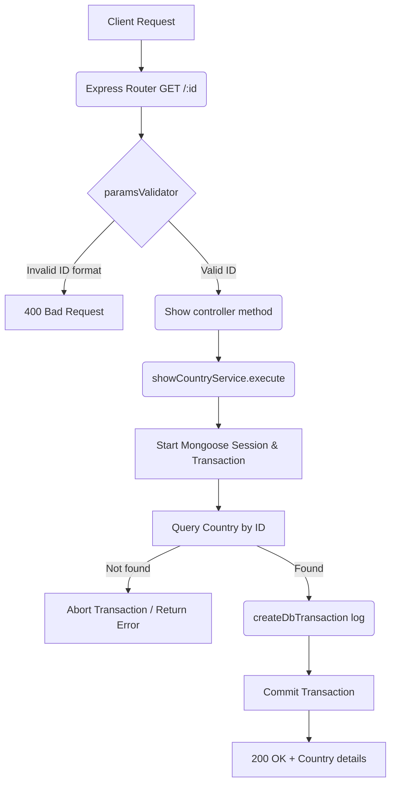

# Show Country Workflow

**Title:** Get Country Details by ID

## **Workflow Diagram**

## **Acceptance Criteria**

- **Required parameters:**
  - `id` in request path (valid MongoDB ObjectId)

## **Validation & Error Handling**

- If `id` format is invalid -> `invalid_id`
- If country does not exist -> `country_not_found`

## **Transaction & Consistency**

- Runs inside a transactional session.
- Commits on success and logs the GET Read event in activity logs.

## **Response**

### **Success Response:**
- Code: `200 OK`
- Message: `"country_shown"`
- Data: Country document details

### **Error Response:**
- Code: `400 Bad Request` / `404 Not Found`
