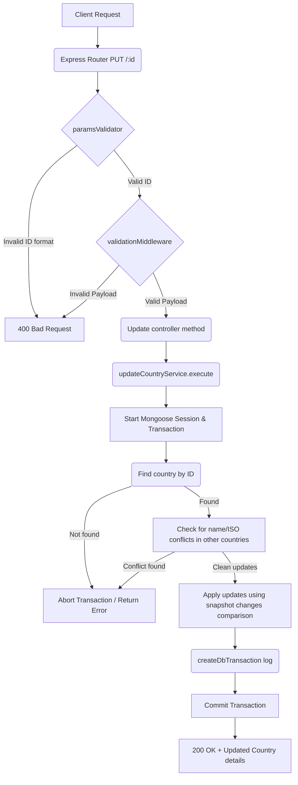

# Update Country Workflow

**Title:** Update Country Details

## **Workflow Diagram**

## **Acceptance Criteria**

- **Required parameters:**
  - `id` in path (valid MongoDB ObjectId)
- **Optional/Required Fields:**
  - Updatable fields: `name`, `iso_code`, `iso_code_3`, `phone_code`

## **Validation & Error Handling**

- If country is not found -> `country_not_found`
- If modified fields conflict with existing records -> `country_already_exists`

## **Transaction & Consistency**

- Runs inside a Mongoose session.
- Database changes are rolled back on any validation/duplication check failure.
- Commits changes on success, records snapshots differences in transactional audit trail.

## **Response**

### **Success Response:**
- Code: `200 OK`
- Message: `"country_updated"`
- Data: Updated country document details

### **Error Response:**
- Code: `400 Bad Request` / `409 Conflict` / `404 Not Found`
