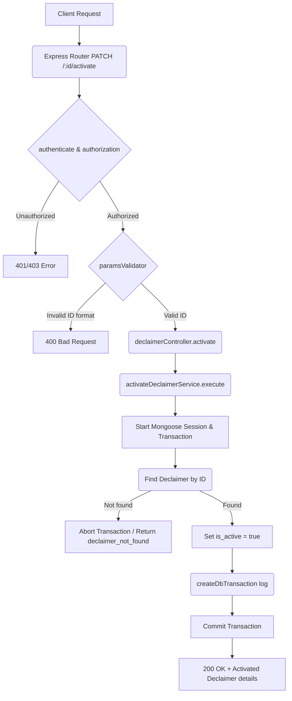

# Activate Declaimer Workflow

**Title:** Enable/Activate Declaimer

## **Workflow Diagram**

## **Acceptance Criteria**

- **Required parameters:**
  - `id` in path (valid MongoDB ObjectId)

## **Validation & Error Handling**

- If declaimer is not found -> `declaimer_not_found`

## **Transaction & Consistency**

- Runs inside a transactional session.
- Logs update transaction log upon success.

## **Response**

### **Success Response:**
- Code: `200 OK`
- Message: `"declaimer_activated"`
- Data: Updated declaimer details (`is_active: true`)

### **Error Response:**
- Code: `400 Bad Request` / `404 Not Found`
