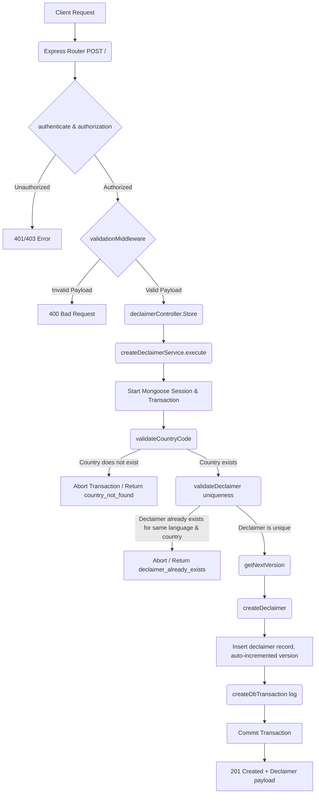

# User Story: Create a Declaimer

**Title:** As an Admin, I want to create a new declaimer.

## **Workflow Diagram**

## **Acceptance Criteria**

When creating a declaimer:

### **Required Fields:**

- key → must be a non-empty string (unique identifier for the declaimer type).
- language → must be a non-empty string (e.g., "en", "fr").
- country → must be a valid ISO country code (must exist in the Country collection).
- title → must be a non-empty string.
- content → must be a non-empty string.

### **Optional Fields:**

- description → string or null/empty.
- metadata → object or null.

### **Internally Managed Fields (cannot be set by client):**

- version → automatically generated based on existing declaimers.
- created_at, updated_at → automatically set by the system.
- deleted_at → optional, defaults to null.
- is_deleted → defaults to false.
- created_by, updated_by, deleted_by → system-managed.

### **Validation Rules:**

- country must exist in the Country collection (validated via iso_code).
- Only one declaimer per **language + country** is allowed.
- If a declaimer already exists for the same language and country:
  - Return an error with:
    - update_allowed = true
    - existing declaimer details (id, title, key, language, country).
- version is auto-incremented:
  - First record → version = 1
  - Subsequent records → version = last version + 1 (based on key + language + country).
- Any additional fields not defined above will result in validation error.

## **Validation & Error Handling**

- If country does not exist → return **country_not_found** error.
- If declaimer already exists (same language + country) → return **declaimer_already_exists** error with update hint.
- If declaimer creation fails → return **declaimer_not_created** error.
- Any unexpected error during the process → return standardized error response.
- All known errors are rethrown and mapped using predefined error messages.

## **Transaction & Consistency**

- All operations run inside a **Mongoose session**.
- Steps executed within the transaction:
  1. Validate country existence.
  2. Validate declaimer uniqueness.
  3. Calculate next version.
  4. Create declaimer.

- On failure at any step:
  - Transaction is **aborted**.
  - No partial data is saved.

- On success:
  - Transaction is **committed**.
  - Response includes the created declaimer.

## **Response**

### **Success Response:**

- Message: `"declaimer_created"`
- Data: Array containing the created declaimer object.

### **Error Response:**

- Standardized error format using `buildErrorResult`.
- Includes:
  - error message
  - mapped error code
  - optional metadata (for update scenarios)

## **Core Functions / Class Responsibilities**

| Function / Class    | Responsibility                                                              |
| ------------------- | --------------------------------------------------------------------------- |
| execute             | Main entry point. Handles transaction lifecycle and orchestrates all steps. |
| validateCountryCode | Verifies that the provided country exists in the database.                  |
| validateDeclaimer   | Ensures no declaimer exists for the same language and country combination.  |
| getNextVersion      | Retrieves and calculates the next version number for the declaimer.         |
| createDeclaimer     | Persists the declaimer in the database within the transaction.              |
