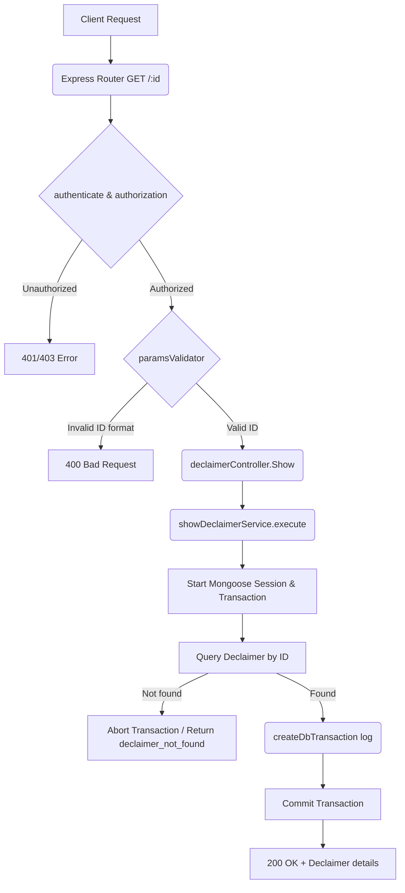

# User Story: Get Declaimer Details

**Title:** As an Admin, I want to fetch a declaimer by ID.

## **Workflow Diagram**

## **Acceptance Criteria**

When fetching a declaimer:

### **Required Input:**

- object_id → must be a valid MongoDB ObjectId.

## **Validation Rules**

- object_id must be a valid MongoDB ObjectId.
- If object_id is invalid:
  - Return **invalid_id** error.
- If no declaimer is found for the given ID:
  - Return **declaimer_not_found** error.

## **Data Retrieval Behavior**

- The declaimer is fetched using its unique ObjectId.
- Related fields are populated using predefined `populateFields`.
- The result is returned as a formatted response.

## **Transaction & Audit Trail**

- Operation runs inside a **Mongoose session**.
- Steps executed within transaction:
  1. Validate ObjectId format.
  2. Validate declaimer existence.
  3. Fetch declaimer with populated fields.
  4. Record database transaction log.

- On failure:
  - Transaction is **aborted**.
  - No partial operations are committed.

- On success:
  - Transaction is **committed**.

## **Audit Logging**

- Each fetch operation is recorded using `createDbTransaction`:
  - table: Declaimers
  - method: GET
  - operation: Read
  - payload: fetched declaimer
