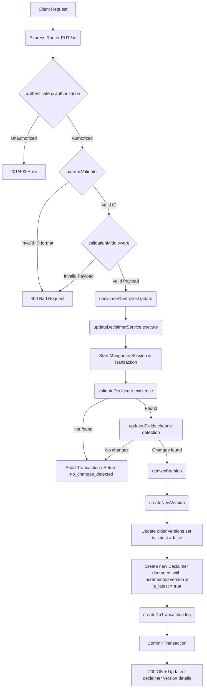

# User Story: Update a Declaimer

**Title:** As an Admin, I want to update a declaimer by creating a new version.

## **Workflow Diagram**

## **Acceptance Criteria**

When updating a declaimer:

### **Required Inputs:**

- object_id → must be a valid MongoDB ObjectId.
- payload → must contain at least one field to update.

### **Updatable Fields:**

- title → non-empty string.
- content → non-empty string.
- description → string or null.
- metadata → object or null.

### **Non-Updatable / System Fields:**

- key, language, country → cannot be changed.
- version → auto-generated.
- is_latest → managed by system.
- created_at, updated_at → auto-managed.
- deleted_at, is_deleted → not affected by update flow.

## **Validation Rules**

- object_id must be valid.
- declaimer must exist.
- At least one field must be different from the existing document.
- If no changes are detected:
  - Return **no_changes_detected** error.
- Updates are implemented as **versioning**, not direct modification:
  - Existing record remains unchanged.
  - New record is created with incremented version.

## **Versioning Rules**

- Version is calculated based on **key + language + country**.
- Next version:
  - latest version + 1
- Previous records:
  - `is_latest = false`
- New record:
  - `is_latest = true`

## **Validation & Error Handling**

- If ObjectId is invalid → return **invalid_id** error.
- If declaimer not found → return **declaimer_not_found** error.
- If no changes detected → return **no_changes_detected** error.
- If new version creation fails → return **declaimer_not_created** error.
- Any unexpected error:
  - Return standardized error using `buildErrorResult`.
- Known errors:
  - Rethrown and mapped via predefined error messages.

## **Transaction & Consistency**

- All operations run inside a **Mongoose session**.

### **Steps executed within the transaction:**

1. Validate ObjectId.
2. Fetch existing declaimer.
3. Detect updated fields.
4. Calculate next version.
5. Mark previous versions as `is_latest = false`.
6. Create new declaimer version.
7. Track changes (audit log).

### **Failure Handling:**

- Transaction is **aborted**.
- No partial updates are saved.

### **Success Handling:**

- Transaction is **committed**.
- Response includes:
  - Newly created version
  - Audit transaction logs

## **Response**

### **Success Response:**

- Message: `"declaimer_updated"`
- Data:
  - Updated declaimer (new version)
  - Transaction logs

### **Error Response:**

- Standardized format using `buildErrorResult`
- Includes:
  - error message
  - mapped error code
  - optional metadata

## **Core Functions / Class Responsibilities**

| Function / Class    | Responsibility                                                      |
| ------------------- | ------------------------------------------------------------------- |
| execute             | Main entry point. Manages transaction and orchestrates update flow. |
| validateDeclaimer   | Ensures the declaimer exists.                                       |
| getNextVersion      | Calculates next version number.                                     |
| createNewVersion    | Creates new version and updates previous records.                   |
| updatedFields       | Detects changed fields between payload and original.                |
| createDbTransaction | Logs audit trail of changes.                                        |

## **Key Design Decisions**

- Uses **immutable update pattern** (no in-place updates).
- Maintains **full version history**.
- Ensures **only one latest version exists**.
- Provides **audit logging for traceability**.
- Prevents unnecessary writes via change detection.
