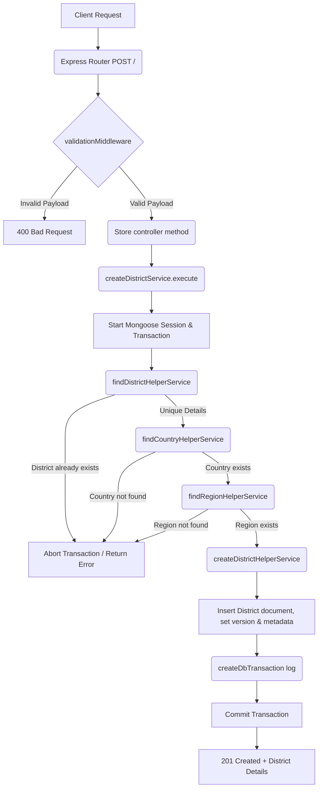

# Create District Workflow

**Title:** Create a New District Record

## **Workflow Diagram**

## **Acceptance Criteria**

- **Required Fields:**
  - `name` (String, min 1, max 100)
  - `code` (String, min 1, max 10, unique code)
  - `country_id` (valid MongoDB ObjectId, country must exist)
  - `region_id` (valid MongoDB ObjectId, region must exist)

## **Validation & Error Handling**

- If district code/name already exists -> `district_already_exists`
- If country does not exist -> `country_not_found`
- If region does not exist -> `region_not_found`

## **Transaction & Consistency**

- Execution runs inside Mongoose session transaction.
- Rolls back on duplicate details or referenced collection checks failure.
- Logs create transaction on success.

## **Response**

### **Success Response:**
- Code: `201 Created`
- Message: `"district_created"`
- Data: Created district document details

### **Error Response:**
- Code: `400 Bad Request` / `409 Conflict` / `404 Not Found`
