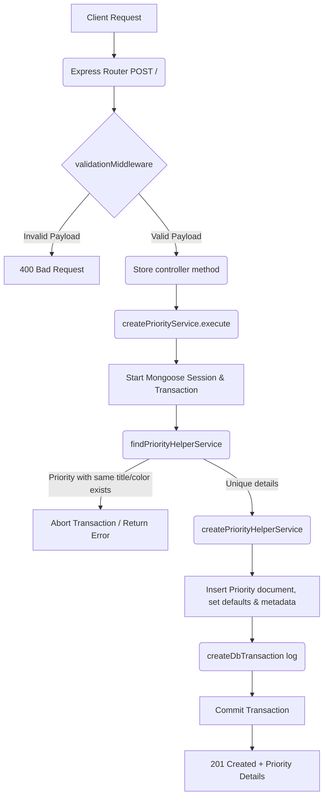

# Create Priority Workflow

**Title:** Create a New Priority Level

## **Workflow Diagram**

## **Acceptance Criteria**

- **Required Fields:**
  - `title` (String, min 1, max 100, unique)
  - `color` (String, min 1, max 100, hex color or style descriptor)

## **Validation & Error Handling**

- If priority with duplicate title/color exists -> `priority_already_exists`

## **Transaction & Consistency**

- Runs inside a transactional session.
- Failure of duplicates check rolls back all operations.
- Logs create transaction on success.

## **Response**

### **Success Response:**
- Code: `201 Created`
- Message: `"priority_created"`
- Data: Created priority document details

### **Error Response:**
- Code: `400 Bad Request` / `409 Conflict`
