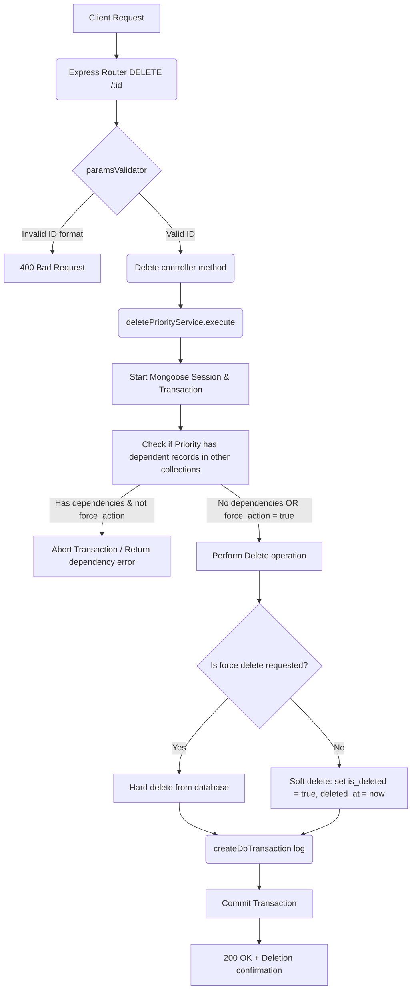

# Delete Priority Workflow

**Title:** Soft/Force Delete Priority Level

## **Workflow Diagram**

## **Acceptance Criteria**

- **Required parameters:**
  - `id` in path (valid MongoDB ObjectId)
- **Optional Query parameters:**
  - `force_action` (Boolean)

## **Validation & Error Handling**

- If priority ID is invalid -> `invalid_id`
- If priority does not exist -> `priority_not_found`
- Relational check for other modules using this priority level.

## **Response**

### **Success Response:**
- Code: `200 OK`
- Message: `"priority_deleted"`
- Data: Deleted priority document details

### **Error Response:**
- Code: `400 Bad Request` / `409 Conflict` / `404 Not Found`
