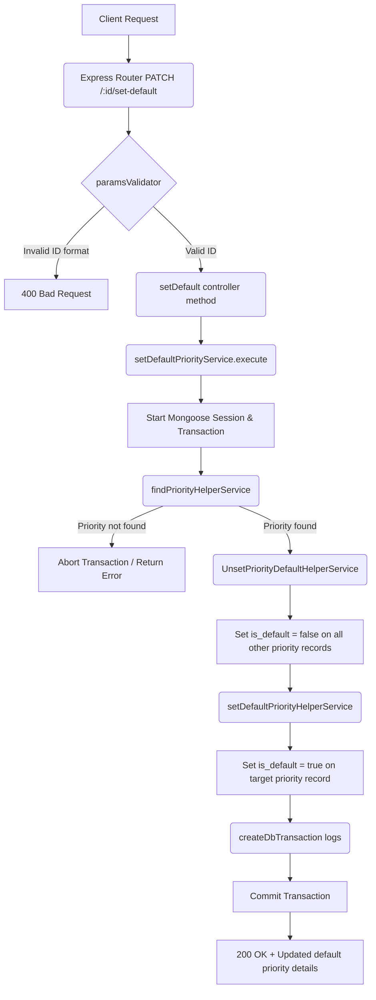

# Set Default Priority Workflow

**Title:** Set Default Priority Record

## **Workflow Diagram**

## **Acceptance Criteria**

- **Required parameters:**
  - `id` in path (valid MongoDB ObjectId representing the priority)

## **Validation & Error Handling**

- If priority is not found -> `priority_not_found`

## **Transaction & Consistency**

- Runs inside a transactional Mongoose session.
- Unsets any existing defaults first to ensure only one record is marked default.
- Logs updates in DbTransaction audits.

## **Response**

### **Success Response:**
- Code: `200 OK`
- Message: `"default_priority_set"`
- Data: Updated default priority document details

### **Error Response:**
- Code: `400 Bad Request` / `404 Not Found`
