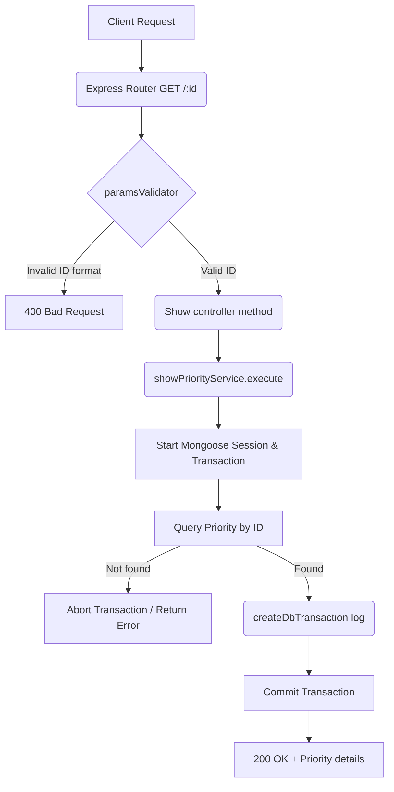

# Show Priority Workflow

**Title:** Get Priority Details by ID

## **Workflow Diagram**

## **Acceptance Criteria**

- **Required parameters:**
  - `id` in path (valid MongoDB ObjectId)

## **Validation & Error Handling**

- If priority does not exist -> `priority_not_found`

## **Response**

### **Success Response:**
- Code: `200 OK`
- Message: `"priority_shown"`
- Data: Priority document details

### **Error Response:**
- Code: `400 Bad Request` / `404 Not Found`
