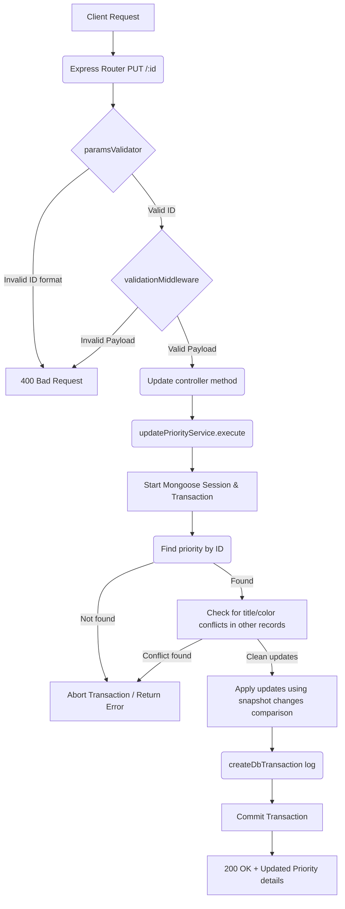

# Update Priority Workflow

**Title:** Update Priority Details

## **Workflow Diagram**

## **Acceptance Criteria**

- **Required parameters:**
  - `id` in path (valid MongoDB ObjectId)
- **Required/Optional Fields:**
  - Updatable fields: `title`, `color`

## **Validation & Error Handling**

- If priority is not found -> `priority_not_found`
- If modified fields conflict with existing records -> `priority_already_exists`

## **Response**

### **Success Response:**
- Code: `200 OK`
- Message: `"priority_updated"`
- Data: Updated priority document details

### **Error Response:**
- Code: `400 Bad Request` / `409 Conflict` / `404 Not Found`
