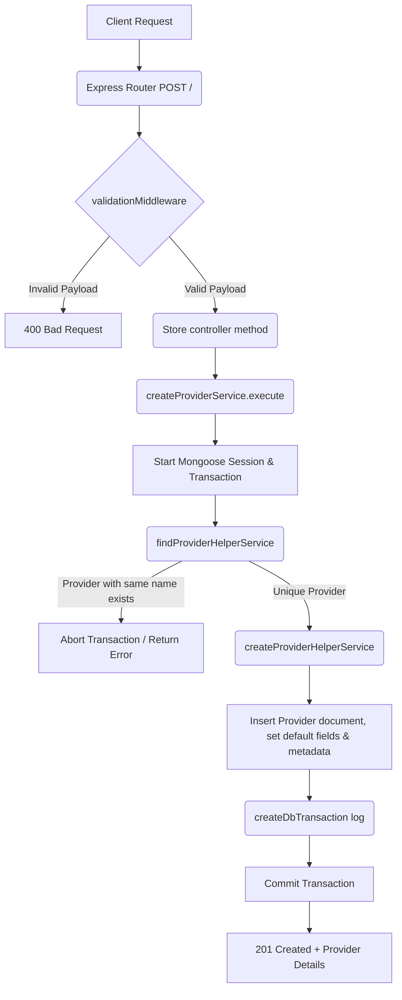

# Create Provider Workflow

**Title:** Create a New Provider Record

## **Workflow Diagram**

## **Acceptance Criteria**

- **Required Fields:**
  - `name` (String, min 1, max 100, unique)
- **Optional Fields:**
  - `description` (String, min 1, max 100)

## **Validation & Error Handling**

- If provider with same name exists -> `provider_already_exists`

## **Transaction & Consistency**

- Runs inside Mongoose transaction.
- Rolls back changes on name duplicates violation.
- Logs create transaction on success.

## **Response**

### **Success Response:**
- Code: `201 Created`
- Message: `"provider_created"`
- Data: Created provider document details

### **Error Response:**
- Code: `400 Bad Request` / `409 Conflict`
