# Deactivate Provider Workflow

**Title:** Disable/Deactivate Provider Record

## **Workflow Diagram**

```mermaid
flowchart TD
    A[Client Request] --> B(Express Router PATCH /:id/disable)
    B --> C(deactivate controller method)
    C --> D(disableProviderService.execute)
    D --> E[Start Mongoose Session & Transaction]
    E --> F(Find Provider by ID)
    F -- Not found --> G[Abort Transaction / Return Error]
    F -- Found --> H[Set is_active = false]
    H --> I(createDbTransaction log)
    I --> J[Commit Transaction]
    J --> K[200 OK + Deactivated provider details]
```

## **Acceptance Criteria**

- **Required parameters:**
  - `id` in path (valid MongoDB ObjectId)

## **Response**

### **Success Response:**
- Code: `200 OK`
- Message: `"provider_deactivated"`
- Data: Updated provider details (`is_active: false`)

### **Error Response:**
- Code: `400 Bad Request` / `404 Not Found`
