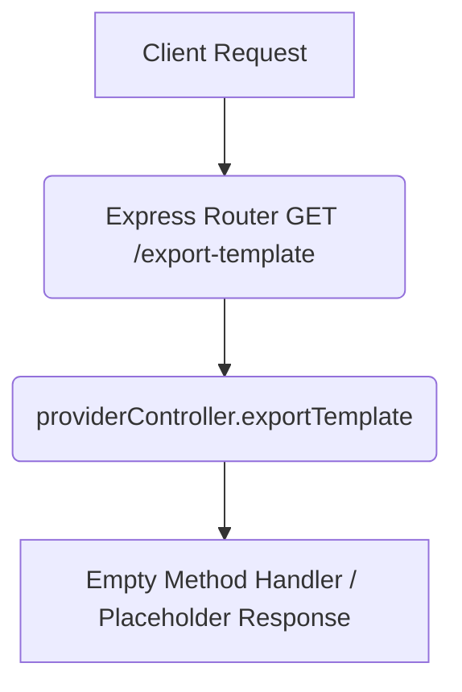

# Export Providers Template (Draft) Workflow

**Title:** Download Import CSV/Excel Template (Draft Placeholder)

> [!NOTE]
> This endpoint is currently a draft placeholder and has no active controller logic.

## **Workflow Diagram**

## **Response**

- Current implementation does not return a response.
