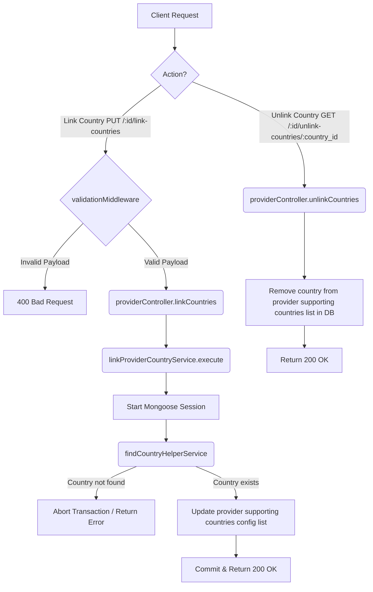

# Link/Unlink Countries Workflow

**Title:** Link and Unlink Supporting Countries to/from Provider

## **Workflow Diagram**

## **Acceptance Criteria**

### **Link Countries Required Fields:**
- `countryId` (valid MongoDB ObjectId, must exist)
- `supportFrom` (Date)
- `config` (Object, containing webhook URL, headers, API keys etc.)

### **Unlink Countries Required Parameters:**
- `id` (Provider ObjectId in path)
- `country_id` (Country ObjectId in path)

## **Response**

### **Success Response:**
- Code: `200 OK`
- Message: `"countries_linked"` / `"countries_unlinked"`
- Data: Updated provider document
