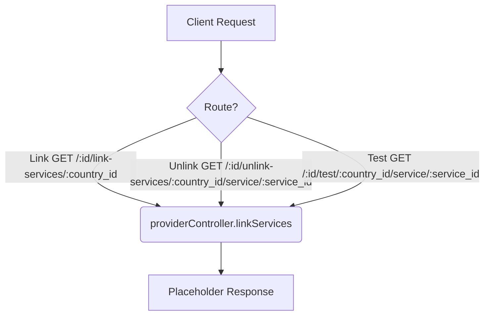

# Link Services/Test Provider (Draft) Workflow

**Title:** Provider Service Configuration and Verification (Draft Placeholder)

> [!NOTE]
> These endpoints are currently stubs and route to an empty placeholder handler.

## **Workflow Diagram**

## **Proposed Acceptance Criteria**

- Validation of `id`, `country_id`, and `service_id` existence.
- Verification of network ping or API handshake with external provider gateways.
