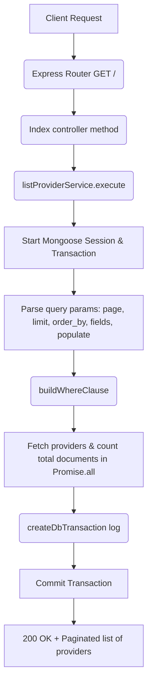

# List Providers Workflow

**Title:** List Providers with Pagination and Filtering

## **Workflow Diagram**

## **Acceptance Criteria**

- **Optional Query Parameters:**
  - `page` (Number, default 1)
  - `limit` (Number, default 10)
  - `order_by` (String)
  - `order_direction` (String: `"asc"` or `"desc"`)
  - `fields` (Comma-separated columns select list)
  - `populate` (Relational fields to resolve)

## **Response**

### **Success Response:**
- Code: `200 OK`
- Message: `"provider_listed"`
- Data: Paginated array including pagination headers and list items

### **Error Response:**
- Code: `500 Internal Server Error`
