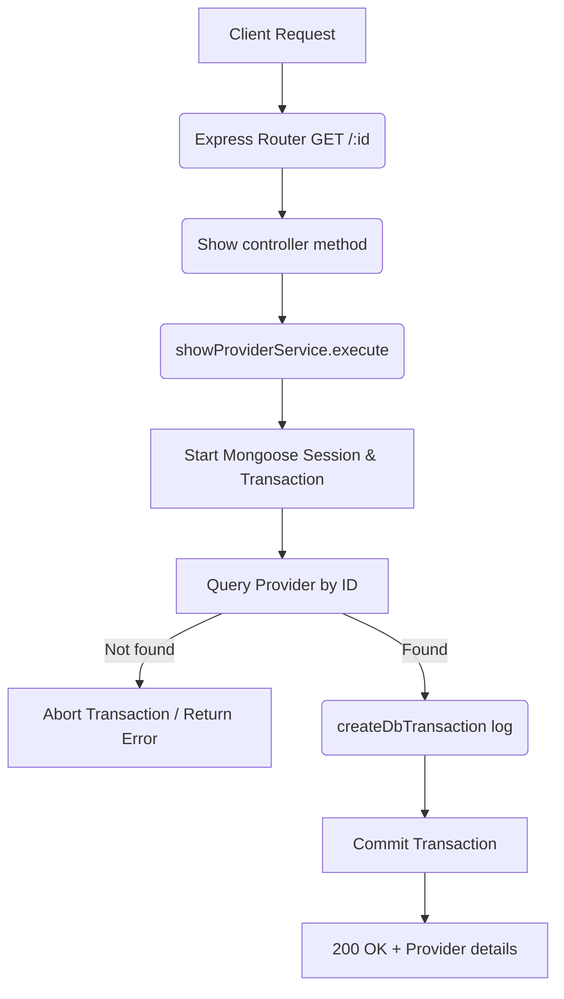

# Show Provider Workflow

**Title:** Get Provider Details by ID

## **Workflow Diagram**

## **Acceptance Criteria**

- **Required parameters:**
  - `id` in request path (valid MongoDB ObjectId)

## **Validation & Error Handling**

- If provider does not exist -> `provider_not_found`

## **Response**

### **Success Response:**
- Code: `200 OK`
- Message: `"provider_shown"`
- Data: Provider document details

### **Error Response:**
- Code: `400 Bad Request` / `404 Not Found`
