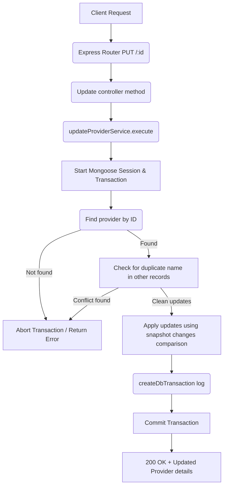

# Update Provider Workflow

**Title:** Update Provider Details

## **Workflow Diagram**

## **Acceptance Criteria**

- **Required parameters:**
  - `id` in path (valid MongoDB ObjectId)
- **Updatable fields:**
  - `name` (String, min 1, max 100)
  - `description` (String, min 1, max 100)

## **Validation & Error Handling**

- If provider is not found -> `provider_not_found`
- If modified fields conflict with existing records -> `provider_already_exists`

## **Response**

### **Success Response:**
- Code: `200 OK`
- Message: `"provider_updated"`
- Data: Updated provider document details

### **Error Response:**
- Code: `400 Bad Request` / `409 Conflict` / `404 Not Found`
