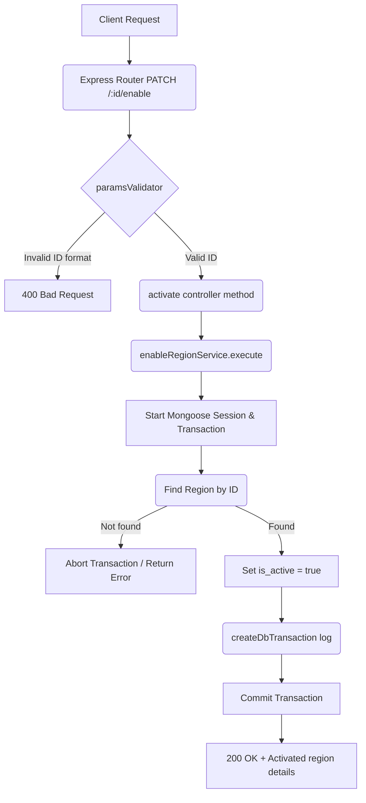

# Activate Region Workflow

**Title:** Enable/Activate Region Record

## **Workflow Diagram**

## **Acceptance Criteria**

- **Required parameters:**
  - `id` in path (valid MongoDB ObjectId)

## **Response**

### **Success Response:**
- Code: `200 OK`
- Message: `"region_activated"`
- Data: Updated region details (`is_active: true`)

### **Error Response:**
- Code: `400 Bad Request` / `404 Not Found`
