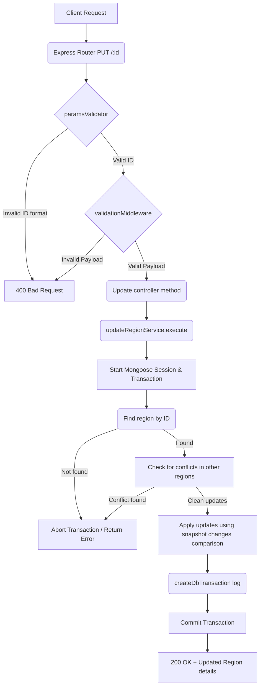

# Update Region Workflow

**Title:** Update Region Details

## **Workflow Diagram**

## **Acceptance Criteria**

- **Required parameters:**
  - `id` in path (valid MongoDB ObjectId)
- **Required/Optional Fields:**
  - Updatable fields: `name`, `code`, `country_id`

## **Validation & Error Handling**

- If region is not found -> `region_not_found`
- If modified fields conflict with existing records -> `region_already_exists`
- Checks referenced `country_id` existence.

## **Response**

### **Success Response:**
- Code: `200 OK`
- Message: `"region_updated"`
- Data: Updated region document details

### **Error Response:**
- Code: `400 Bad Request` / `409 Conflict` / `404 Not Found`
