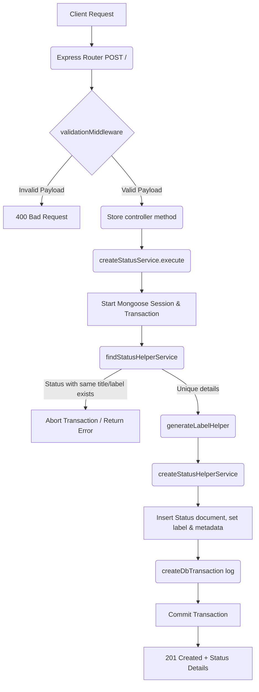

# Create Status Workflow

**Title:** Create a New Status Record

## **Workflow Diagram**

## **Acceptance Criteria**

- **Required Fields:**
  - `title` (String, min 1, max 100, unique title)
  - `color` (String, min 1, max 100, color descriptor)
- **Internally Managed Fields:**
  - `label` (String, auto-generated slug of `title`)

## **Validation & Error Handling**

- If status with duplicate title/label exists -> `status_already_exists`

## **Transaction & Consistency**

- Execution runs inside Mongoose session transaction.
- Rolls back on duplicates check failure.
- Logs create transaction on success.

## **Response**

### **Success Response:**
- Code: `201 Created`
- Message: `"status_created"`
- Data: Created status document details

### **Error Response:**
- Code: `400 Bad Request` / `409 Conflict`
