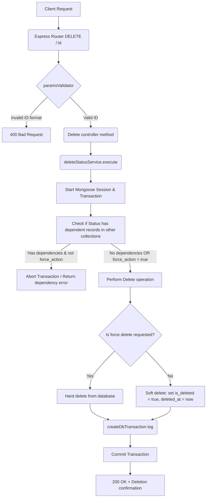

# Delete Status Workflow

**Title:** Soft/Force Delete Status Record

## **Workflow Diagram**

## **Acceptance Criteria**

- **Required parameters:**
  - `id` in path (valid MongoDB ObjectId)
- **Optional Query parameters:**
  - `force_action` (Boolean)

## **Validation & Error Handling**

- If status ID is invalid -> `invalid_id`
- If status does not exist -> `status_not_found`
- Relational dependencies check with all tables matching by status field.

## **Response**

### **Success Response:**
- Code: `200 OK`
- Message: `"status_deleted"`
- Data: Deleted status document details

### **Error Response:**
- Code: `400 Bad Request` / `409 Conflict` / `404 Not Found`
