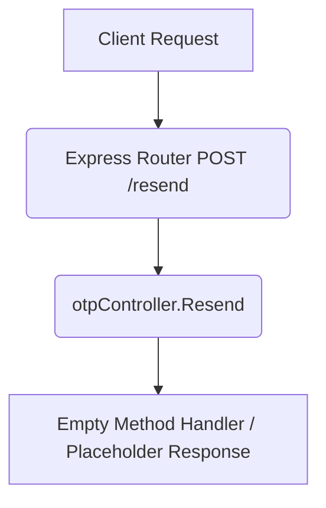

# Resend OTP (Draft) Workflow

**Title:** Resend OTP Code (Draft Placeholder)

> [!NOTE]
> This endpoint is currently a draft placeholder and has no active backend controller implementation.

## **Workflow Diagram**

## **Proposed/Future Acceptance Criteria**

- **Required Fields:**
  - `otp_id` (String)
- **Validation Rules:**
  - Rate limiting check, generate a new code and hash, dispatch via SMS.

## **Response**

- Current implementation does not return a response.
