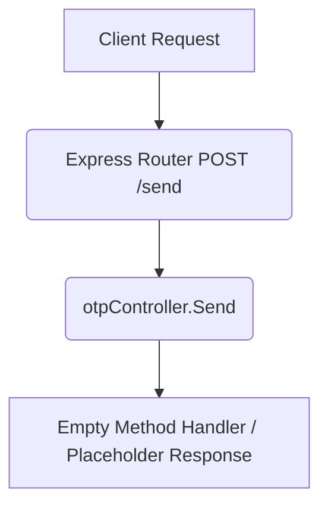

# Send OTP (Draft) Workflow

**Title:** Generate and Send OTP (Draft Placeholder)

> [!NOTE]
> This endpoint is currently a draft placeholder and has no active backend controller implementation.

## **Workflow Diagram**

## **Proposed/Future Acceptance Criteria**

- **Required Fields:**
  - `phone` (String)
  - `country` (String)
- **Validation Rules:**
  - Phone validation format logic
  - Check limits, generate OTP, hash it, store and trigger SMS gateway dispatch

## **Response**

- Current implementation does not return a response (hangs or returns empty 200).
- Proposed response: `200 OK` with OTP identification session ID.
