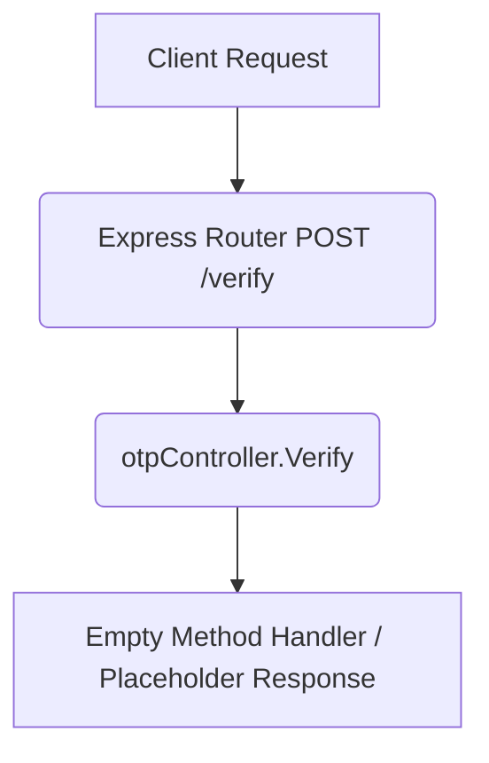

# Verify OTP (Draft) Workflow

**Title:** Validate OTP Code (Draft Placeholder)

> [!NOTE]
> This endpoint is currently a draft placeholder and has no active backend controller implementation.

## **Workflow Diagram**

## **Proposed/Future Acceptance Criteria**

- **Required Fields:**
  - `otp_id` (String)
  - `code` (String, 6-digits)
- **Validation Rules:**
  - Compare hashes and check expiration.

## **Response**

- Current implementation does not return a response (hangs or returns empty 200).
- Proposed response: `200 OK` with verification payload.
