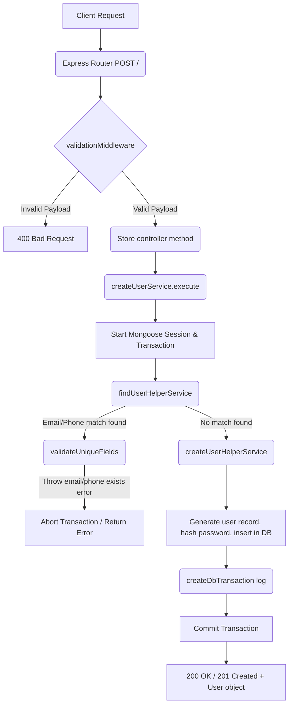

# Create User Workflow

**Title:** Create User Profile

## **Workflow Diagram**

## **Acceptance Criteria**

- **Required Fields:**
  - `email` (String, valid email)
  - `phone` (String, E.164 phone format)
  - `password` (String, hashed internally)
  - `user_type` (String)
  - `first_name` (String)
  - `last_name` (String)

## **Validation & Error Handling**

- If user with same email exists -> `email_already_exists`
- If user with same phone exists -> `phone_already_exists`

## **Transaction & Consistency**

- Runs inside a Mongoose session transaction.
- Rolls back changes on constraint checks failure.
- Successful user creation stores record and inserts transactional details into database.

## **Response**

### **Success Response:**
- Code: `200 OK` / `201 Created`
- Message: `"user_created"`
- Data: User document details

### **Error Response:**
- Code: `400 Bad Request` / `409 Conflict`

## **Core Functions / Class Responsibilities**

| Function / Class | Responsibility |
| --- | --- |
| createUserService | Manages user checks and transaction lifetime. |
| findUserHelperService | Queries existing database users for email or phone conflicts. |
| createUserHelperService | Inserts User document and triggers database transaction audits. |
